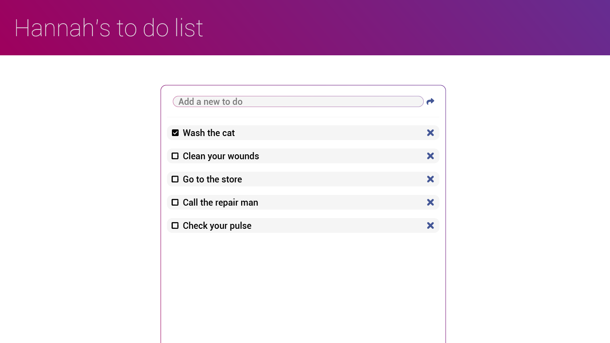
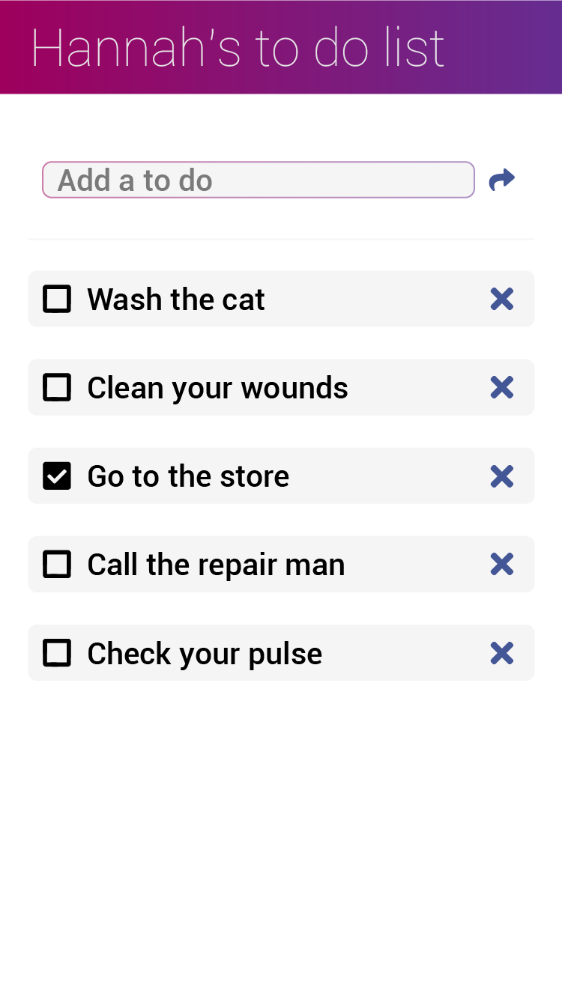

# Todo List App

The first phase of this project includes creating a todo list application with Node.js, Express and Express routes, and jQuery's AJAX method.

Create a todo list application that matches the mobile and desktop designs below:

Use [Font Awesome](https://fontawesome.com/) for the icons. The font used is Roboto from Google Fonts. 

### Project must include the following requirements:

- Use array methods instead of for loops
- Make a GET route for getting all todo list items
- Make a POST route for adding a new todo list item
- Make a DELETE route for deleting a todo list item using the X button next to it
- Make a PUT route for updating a todo list item when it is checked or unchecked
- Modularize your routes by seperating your Express routes into a seperate route file
- No global variables other than functions and state (front-end)
- Use a single render function to render items to the page (front-end)
- Use AJAX (part of the jQuery library) to make GET, POST, PUT, and DELETE requests from the front-end
- Deploy the final application to Heroku.  (todo_application repo connected with todo-app-bootcamp)

The second phase of the project will add a database to store todo entries even if the server application is reset. 